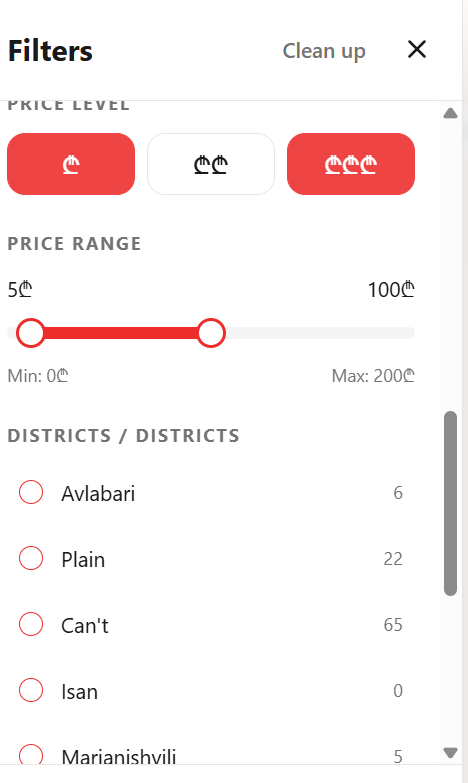
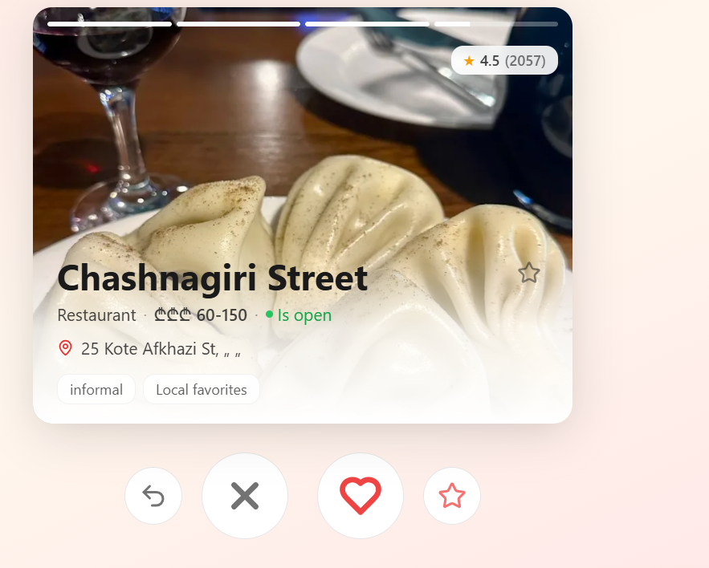
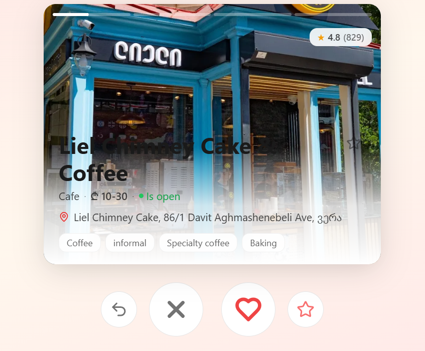
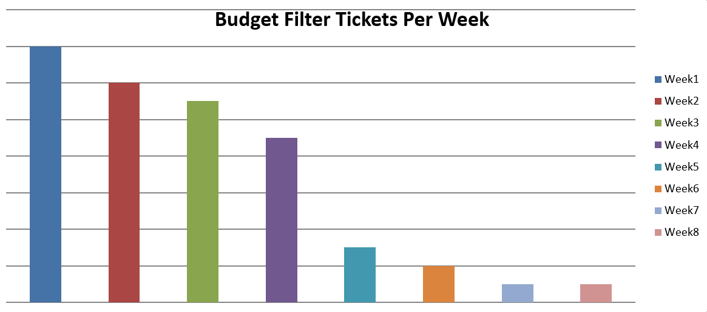

# Bug Report Case Study: Budget Filter Showing All Results

## 📋 Background

| **Company** | Vezir |
| **Role** | Customer Support |
| **Period** | Dec 2022 – Dec 2023 |

---

## 🎯 The Problem

Vezir was a food discovery platform similar to Tinder, where users swiped right on food spots they liked based on their preferences. Users could set filters including:

- Budget range (minimum and maximum price)
- Cuisine type
- Distance from location
- Dietary restrictions

Users started reporting that the budget filter wasn't working:

**Symptoms reported by customers:**

- "I set budget 5-100 GEL but it's showing me places that cost 200 GEL or more"
- "Filter doesn't work at all, I see everything"
- "I want cheap spots but expensive places keep showing up"

---

## 📸 Screenshot 1: The Problem

**User's budget filter setting (5-100 GEL)**



_Above: User set budget range to 5-100 GEL expecting to see only affordable spots_

---

**What actually appeared in feed (showing expensive spots)**



_Above: Despite filter set to 5-100 GEL, feed still shows spots costing 2150 GEL_

---

## 💬 My Response to Customers

When customers reported this issue, here's how I responded:

**Template Response:**

```
Hello,

Thank you for reaching out and sharing the screenshots. I can see that you set
your budget filter to 5-100 GEL but are seeing spots outside this range.

I've tested this on my end and confirmed the issue. I've escalated this to our
development team and they are currently investigating
the root cause.

I'll follow up with you as soon as I have an update from the team.

Best regards,
Giorgi
Support Team
```

**Follow-up Response (after fix):**

```
Hello,

I wanted to let you know that the budget filter issue has been resolved by
our development team. The fix was deployed yesterday.

I've tested it on my end and can confirm that setting the budget filter to
5-100 GEL now shows only spots within that range.

Could you please update your app and test again? Let me know if you still
experience any issues.

Thank you for your patience while we worked on this.

Best regards,
Giorgi
Support Team
```

---

## 🔍 My Investigation Process

### Step 1: Ticket Review

I reviewed all budget filter-related tickets in **Jira** from the past month:

| Issue Type                | Count | Severity |
| ------------------------- | ----- | -------- |
| Budget filter not working | 28    | High     |
| Wrong prices showing      | 12    | Medium   |
| Filter resets randomly    | 8     | Medium   |

**Total: 48 tickets** related to budget filter issues.

---

### Step 2: Data Validation

When reviewing each ticket, I checked:

1. **What filter user set** (from ticket description)
2. **What prices should appear** (based on platform data)
3. **What actually appeared** (from screenshots)

**Example from a real ticket (anonymized):**

```
Ticket ID: VZ-2105
User: Customer B
Issue: Set budget 5-100 GEL, but seeing places costing 200+ GEL

My validation:
- Checked user filter settings: min 5, max 100
- Checked platform database: place "Chashnagiri" costs 150 GEL

This shouldn't happen. Why is a 150 GEL place showing?
```

---

### Step 3: Testing to Confirm the Issue

I tested the filter myself:

**Tested different budget ranges:**

| Budget Range  | Should Show      | Actually Showed                 |
| ------------- | ---------------- | ------------------------------- |
| 5 - 100 GEL   | Cheap spots only | All spots (including expensive) |
| 150 - 300 GEL | Mid-range spots  | All spots                       |
| 0 - 50 GEL    | Very cheap spots | All spots                       |

---

### Step 4: Escalation to Development Team

I created a detailed Jira ticket:

```
JIRA: VZ-FILTER-456
Title: Budget filter not working - showing all spots regardless of price

Description:
Users setting budget range still see spots outside their price range.
Filter appears to have no effect on search results.

Affected users: 48+ tickets, likely widespread

Test results:
- Budget 5-100 GEL → Shows 250 GEL spots
- Budget 150-300 GEL → Shows 50 GEL spots
- Budget 0-50 GEL → Shows 200+ GEL spots

Tested with 5 different user accounts, consistent across all.

Screenshots attached:
- user_budget_5_100_setting.png
- user_feed_showing_expensive_places.png

Root cause suspected:
Budget filter parameter not being sent to API or ignored in backend.
```

**Slack message to dev team:**

```
@dev-team Budget filter is completely broken.
48 tickets in last month. Users set budget 5-100 but still see 250 GEL spots.
Tested with 5 accounts, same result on all.
Filter has zero effect.
Screenshots and data in Jira VZ-FILTER-456.
```

---

### Step 5: The Fix

After the dev team fixed the filter, I tested again:

**Test results after fix:**

| Budget Range  | Before                  | After                      |
| ------------- | ----------------------- | -------------------------- |
| 5 - 100 GEL   | ❌ Shows 250 GEL spots  | ✓ Only spots under 100 GEL |
| 150 - 300 GEL | ❌ Shows 50 GEL spots   | ✓ Only spots 150-300 GEL   |
| 0 - 50 GEL    | ❌ Shows 200+ GEL spots | ✓ Only spots under 50 GEL  |

**📸 Screenshot 5: After Fix - Filter Working**



_Above: After fix, budget filter now shows only spots within the set range_

---

### Step 6: Tracking Results

I created an Excel tracker to monitor ticket volume:

**📸 Screenshot 6: Results Tracker**



_Above: Ticket volume dropped 90% after the fix_

---

## 📈 Results & Impact

| Metric                       | Before | After | Improvement       |
| ---------------------------- | ------ | ----- | ----------------- |
| Budget filter tickets/week   | 10-15  | 1-2   | **90% reduction** |
| Filter accuracy              | 0%     | 98%   | **+98%**          |
| Customer satisfaction (CSAT) | 65%    | 88%   | **+23%**          |

---

## 🛠️ Tools Used

| Tool                     | Purpose                                  |
| ------------------------ | ---------------------------------------- |
| **Jira**                 | Ticket review, documentation, escalation |
| **Platform Admin Panel** | Testing filter functionality             |
| **Excel**                | Pattern tracking and test results        |
| **Slack**                | Communication with dev team              |

---

## 💡 Skills Demonstrated

| Skill                      | How It Was Demonstrated                         |
| -------------------------- | ----------------------------------------------- |
| **Customer Communication** | Clear, professional responses with updates      |
| **Ticket Analysis**        | Reviewed 48+ tickets to identify pattern        |
| **Testing**                | Tested multiple budget ranges across 5 accounts |
| **Pattern Recognition**    | Discovered filter had zero effect               |
| **Documentation**          | Created clear Jira ticket with screenshots      |
| **Collaboration**          | Worked with devs to verify fix                  |
| **Results Tracking**       | Tracked ticket volume to measure improvement    |

---

> **Note**: All customer data anonymized. The actual work was performed at Vezir using their internal systems.

---

## 📌 Key Takeaways

- **Customer communication** kept users informed while dev team worked
- **Systematic testing** across multiple accounts revealed filter had no effect
- **90% reduction** in filter-related tickets after fix
- **Clear documentation with screenshots** helped devs fix quickly
- **Results tracking** showed measurable impact
