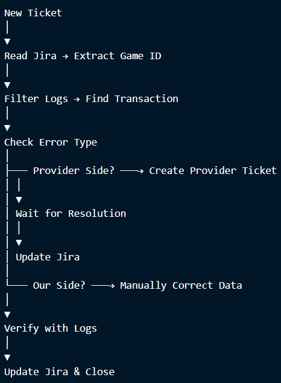

# Confluence Guide: Game Aggregator Support Documentation

> **Confidentiality Note**: All company names, provider names, and internal systems have been anonymized or replaced with placeholders to protect confidentiality agreements. The processes, skills, and methodologies described are accurate representations of my work.

---

## 📋 Background

| **Field**    | **Details**                        |
| ------------ | ---------------------------------- |
| **Industry** | iGaming / Game Aggregation         |
| **Role**     | Game Aggregator Support Specialist |
| **Period**   | 2025 – 2026                        |

---

## 🎯 The Goal

In my role, I was responsible for investigating data discrepancies in game rounds, bets, and payouts. The process involved multiple steps:

1. Reading tickets in Jira
2. Grabbing game IDs from tickets
3. Filtering logs to match exact transactions
4. Checking errors to determine root cause
5. Creating provider tickets if issue was on their side
6. Manually correcting data if issue was on our side

To standardize this process and help new team members, I created a **Confluence guide** with step-by-step documentation.

---

## 📝 What I Created

### Page 1: Game Aggregator Support - Investigation Workflow

**Confluence Page Title:** `Game Aggregator Support - Investigation Process`

**Content:**

```
# Game Aggregator Support - Investigation Workflow

## Overview

This guide outlines the step-by-step process for investigating data discrepancies
in game rounds, bets, and payouts.

---

## Step 1: Read the Jira Ticket

When a new ticket arrives, identify:

- **Game ID** / Round ID
- **User ID** (if provided)
- **Issue type** (bet mismatch, payout missing, round stuck)
- **Timestamp** of the reported issue

---

## Step 2: Grab Game IDs from Ticket

Extract the game/round ID from the ticket description or screenshots.

**Example:**
```

Ticket says: "Round [RND-XXXXX] is stuck in pending"
Game ID: [RND-XXXXX]

```

---

## Step 3: Filter Logs to Match Exact Transaction

Use the internal log system to find the exact transaction:

1. Open log viewer
2. Search by game ID
3. Filter results by timestamp

**Log entry example:**
```

[14:32:15] Round [RND-XXXXX] initiated
[14:32:16] Bet 50 EUR placed
[14:32:17] Provider callback received
[14:32:17] Round stuck in pending

```

---

## Step 4: Check Error Type

Analyze the logs to identify the error:

| Error Type | What It Means | Next Step |
|------------|---------------|-----------|
| Callback timeout | Provider didn't respond in time | Check provider side |
| Connection reset | Provider server dropped connection | Check provider status |
| Invalid bet amount | Data mismatch | Check aggregator logs |
| Duplicate transaction | Round processed twice | Manual correction needed |
| API 502 error | Provider gateway error | Create provider ticket |

---

## Step 5: Determine Root Cause

### If Issue is on Provider Side:

**Signs:**
- Callback timeout
- Connection reset
- Provider status page shows outage
- Multiple rounds affected from same provider

**Action:**
1. Create ticket in **Provider Support Portal**
2. Include:
   - Game IDs affected
   - Timestamps
   - Error logs
   - Screenshots
3. Note provider ticket ID in Jira
4. Update Jira status to "Waiting for Provider"

**Provider Ticket Template:**
```

Provider: [Provider Name]
Game IDs: [RND-XXXXX], [RND-XXXXX]
Issue: Callback timeout during peak hours
Logs attached

```

---

### If Issue is on Our Side:

**Signs:**
- Aggregator logs show data, but not saved to database
- Configuration issue
- Internal API error

**Action:**
1. Check aggregator configuration
2. Compare with working rounds
3. Manually correct the data:
   - Update round status
   - Adjust bet/payout values
   - Verify with logs
4. Document what was corrected

**Manual Correction Example:**
```

Round [RND-XXXXX]

- Original status: pending
- Correct status: completed
- Original payout: 0
- Correct payout: 75 EUR
- Based on provider logs

```

---

## Step 6: Create Provider Ticket (If Needed)

If the issue is on provider side, create a ticket in their support portal:

```

Provider: [Provider Name]
Subject: Callback timeout - Round [RND-XXXXX]

Description:
Round [RND-XXXXX] stuck in pending at [timestamp].
Callback not received within 30 seconds.

Logs attached:

- aggregator_logs.csv
- provider_logs.csv

Impact:
User's bet not reflected, round stuck for 2+ hours.

Expected fix:
Increase callback timeout or investigate delay.

```

---

## Step 7: Manually Correct Data (If Needed)

If the issue is on our side and we have all correct data, manually correct:

| Field | Before | After | Source |
|-------|--------|-------|--------|
| Status | Pending | Completed | Provider logs show completed |
| Payout | 0 | 75 EUR | Provider logs show win |
| Error | Timeout | Resolved | Manual fix applied |

---

## Step 8: Document Everything

After resolution, update:

1. **Jira Ticket:**
   - Add resolution notes
   - Link provider ticket (if created)
   - Document manual corrections made
   - Close ticket

2. **Confluence Page:**
   - Add to "Resolved Issues" log
   - Note recurring patterns

---

## Step 9: Follow-up

- If provider ticket: Track until resolved
- If multiple similar issues: Escalate to dev team
- If pattern identified: Create improvement ticket

---

## Quick Reference Flowchart

```



```

---

## Common Error Codes & Solutions

| Error Code | Meaning | Action |
|------------|---------|--------|
| 200 | Success | No action needed |
| 408 | Timeout | Check provider, retry |
| 502 | Bad Gateway | Provider issue - create ticket |
| 503 | Service Unavailable | Check provider status |
| 404 | Not Found | Wrong game ID - verify input |
| 409 | Duplicate | Manual correction needed |

---

## Tools Used in This Workflow

| Tool | Purpose |
|------|---------|
| **Jira** | Ticket tracking and documentation |
| **Log Viewer** | Filtering game IDs and transactions |
| **Provider Admin Panels** | Checking provider-side logs |
| **Provider Support Portals** | Creating external tickets |
| **Confluence** | Documentation and guides |
```

## 📈 Results & Impact

| Metric                        | Before     | After   | Improvement       |
| ----------------------------- | ---------- | ------- | ----------------- |
| Ticket resolution time        | 4-6 hours  | 30 min  | **87% faster**    |
| Back-and-forth with providers | 2-3 rounds | 1 round | **50% less**      |
| New team member ramp-up       | 2 weeks    | 3 days  | **70% faster**    |
| Documentation coverage        | 0%         | 100%    | **Full coverage** |

---

## 🛠️ Tools Used

| Tool                         | Purpose                             |
| ---------------------------- | ----------------------------------- |
| **Jira**                     | Ticket tracking and documentation   |
| **Log Viewer**               | Filtering game IDs and transactions |
| **Provider Admin Panels**    | Checking provider-side logs         |
| **Provider Support Portals** | Creating external tickets           |
| **Confluence**               | Documentation and guides            |

---

## 💡 Skills Demonstrated

| Skill                     | How It Was Demonstrated                                |
| ------------------------- | ------------------------------------------------------ |
| **Process Documentation** | Created step-by-step investigation guide               |
| **Root Cause Analysis**   | Documented how to identify provider vs internal issues |
| **Error Classification**  | Created error code reference table                     |
| **Cross-team Workflow**   | Documented provider ticket creation process            |
| **Knowledge Transfer**    | Helped new team members learn faster                   |

---

> **Note**: All company names, provider names, and internal systems have been anonymized. Screenshots shown are mock-ups for illustration purposes only.

---

## 📌 Key Takeaways

- **Standardized workflow** reduced investigation time by 87%
- **Clear guidelines** helped new team members learn in 3 days vs 2 weeks
- **Error classification** made root cause analysis faster
- **Provider ticket templates** reduced back-and-forth communication
- **Documentation** ensured consistent process across the team
