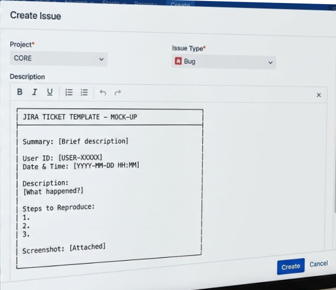
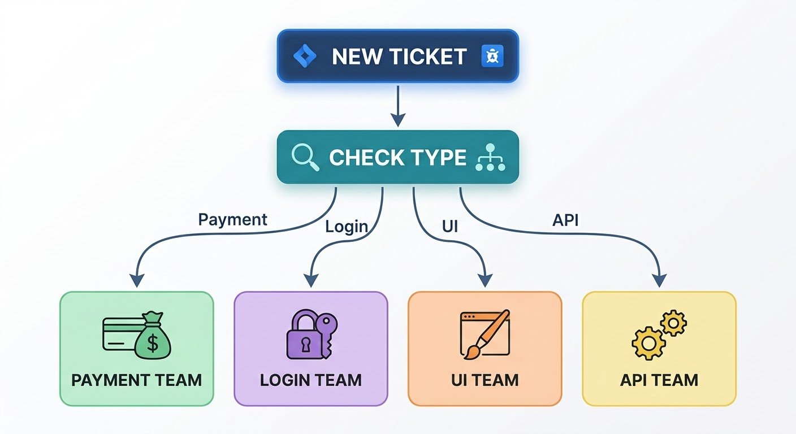
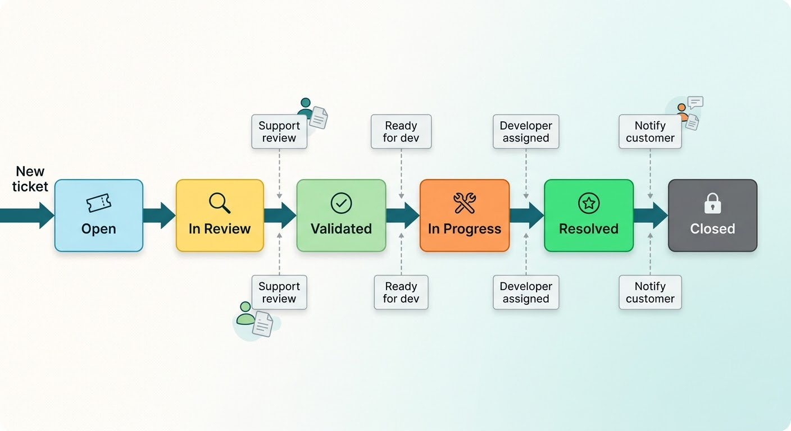

# Jira Workflow Case Study: Ticket Management & Process Optimization

## 📋 Background

| **Company** | Vezir |
| **Role** | Customer Support |
| **Period** | Dec 2022 – Dec 2023 |

---

## 🎯 The Problem

When I started at Vezir, the Jira workflow was chaotic:

- Tickets often missing critical information
- No clear assignment process
- Tickets frequently assigned to wrong teams
- Back-and-forth between support and developers
- No standard for what needed escalation

**Impact:**

- Resolution time: 48+ hours on average
- 40% of tickets needed reassignment
- Developers frustrated with incomplete tickets
- Customers waiting longer for fixes

## 🔧 What I Changed

### Step 1: Analyzed Current Workflow

I reviewed 100 tickets to identify pain points:

| Issue                      | % of Tickets |
| -------------------------- | ------------ |
| Missing user ID            | 45%          |
| Missing screenshots        | 52%          |
| Wrong team assigned        | 40%          |
| No error message           | 38%          |
| Unclear steps to reproduce | 60%          |

---

### Step 2: Created Standard Ticket Templates

I created Jira issue templates for common ticket types:

**Bug Report Template:**

```
Summary: [Brief description of the issue]

---

**User ID:** [Required]
**Date & Time:** [Required]

**Description:**
[What happened?]

**Expected Result:**
[What should have happened?]

**Steps to Reproduce:**
1.
2.
3.

**Error Message:** [If any]
**Screenshot:** [Attach]
**Device/Browser:** [If relevant]
```

**Feature Request Template:**

```
Summary: [Brief description of the request]

---

**User ID:** [Required]
**Business Impact:** [High/Medium/Low]

**Description:**
[What feature is requested?]

**Use Case:**
[How would this help users?]

**Priority:** [Urgent/Normal/Low]
```

---

### Step 3: Defined Team Assignment Rules

I created a clear guide for ticket assignment:

| Issue Type        | Assign To       | Priority |
| ----------------- | --------------- | -------- |
| Payment failures  | Payment Team    | High     |
| Login issues      | Auth Team       | High     |
| UI bugs           | Frontend Team   | Medium   |
| Feature requests  | Product Manager | Low      |
| API errors        | Backend Team    | High     |
| Content issues    | Content Team    | Low      |
| Swipe/save issues | Mobile Team     | Medium   |

**Assignment Flowchart:**

```
New Ticket
    │
    ▼
Check Issue Type
    │
    ├─── Payment Issue? ───→ Payment Team
    │
    ├─── Login Issue? ───→ Auth Team
    │
    ├─── UI Bug? ───→ Frontend Team
    │
    ├─── Swipe/Save? ───→ Mobile Team
    │
    └─── Feature Request? ───→ Product Manager
```

---

### Step 4: Implemented Validation Checklist

Before forwarding tickets to developers, I created a checklist:

**Ticket Validation Checklist:**

```
□ User ID present
□ Screenshot attached (if applicable)
□ Steps to reproduce clear
□ Error message captured
□ Correct team assigned
□ Priority set appropriately
□ Duplicate checked
□ Customer contacted (if needed)
```

---

### Step 5: Created Status Workflow

I helped define a clear status workflow:

```
Open → In Review → Validated → In Progress → Resolved → Closed
  │         │           │            │           │
  │         │           │            │           └── Customer notified
  │         │           │            └── Developer assigned
  │         │           └── Ticket complete, ready for dev
  │         └── Support review complete
  └── New ticket created
```

---

## 📈 Results & Impact

| Metric                  | Before   | After    | Improvement                 |
| ----------------------- | -------- | -------- | --------------------------- |
| Missing info in tickets | 45-60%   | 5-10%    | **85% reduction**           |
| Wrong team assignments  | 40%      | 5%       | **88% reduction**           |
| Back-and-forth rounds   | 3-4      | 0-1      | **75% reduction**           |
| Resolution time         | 48 hours | 16 hours | **67% faster**              |
| Developer satisfaction  | Low      | High     | **Significant improvement** |

---

## 📸 Screenshot Placeholders

### Screenshot 1: Ticket Template



_Above: Standard bug report template in Jira_

---

### Screenshot 2: Assignment Flowchart



_Above: Flowchart showing how to assign tickets to correct teams_

---

### Screenshot 3: Status Workflow



_Above: Visual representation of ticket status flow_

## 🛠️ Tools Used

| Tool           | Purpose                                      |
| -------------- | -------------------------------------------- |
| **Jira**       | Ticket management and workflow configuration |
| **Confluence** | Documentation of processes and templates     |
| **Excel**      | Tracking metrics and improvements            |
| **Slack**      | Communication with teams                     |

---

## 💡 Skills Demonstrated

| Skill                       | How It Was Demonstrated                      |
| --------------------------- | -------------------------------------------- |
| **Workflow Optimization**   | Redesigned ticket process to reduce errors   |
| **Process Documentation**   | Created clear guidelines for ticket handling |
| **Cross-team Coordination** | Defined assignment rules for all teams       |
| **Quality Control**         | Implemented validation checklist             |
| **Metrics Tracking**        | Measured and tracked improvements            |

---

## 📌 Key Takeaways

- **85% reduction** in incomplete tickets through standardized templates
- **88% reduction** in wrong team assignments with clear rules
- **75% less back-and-forth** between support and developers
- **67% faster resolution** time for customers
- **Better team collaboration** and developer satisfaction
