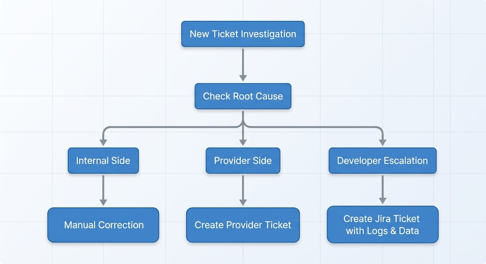

# Escalation Guide: When & How to Escalate Issues

> **Confidentiality Note**: Company names and internal systems have been anonymized to protect confidentiality agreements. The processes, skills, and methodologies described are accurate representations of my work.

---

## 📋 Background

| **Field**    | **Details**                        |
| ------------ | ---------------------------------- |
| **Industry** | iGaming / Game Aggregation         |
| **Role**     | Game Aggregator Support Specialist |
| **Period**   | 2025 – 2026                        |

---

## 🎯 The Goal

In my role, I was responsible for investigating data discrepancies and determining whether issues should be handled internally or escalated. A clear escalation process was critical to:

- Reduce resolution time
- Avoid unnecessary back-and-forth
- Ensure issues reached the right team
- Maintain good relationships with providers

I created an **escalation guide** to help the team know exactly when and how to escalate.

## 📝 What I Created

### Escalation Decision Tree



---

## 📋 When to Escalate to Provider

### Signs It's a Provider Issue:

| Indicator                    | What to Look For                                 |
| ---------------------------- | ------------------------------------------------ |
| **Callback timeout**         | Logs show no response within expected time       |
| **Connection reset**         | Error: "connection reset by peer"                |
| **Provider status page**     | Shows outage or degraded service                 |
| **Multiple rounds affected** | Same error across many rounds from same provider |
| **Provider logs show issue** | Their logs confirm the problem                   |

### Provider Escalation Template:

```
Provider: [Provider Name]
Priority: [High/Medium/Low]
Ticket ID: [Jira ID]

Subject: [Brief description]

Description:
- Issue: [What happened]
- Game IDs affected: [List]
- Timestamp: [When it occurred]
- Impact: [How many users/rounds affected]

Logs attached:
- aggregator_logs.csv
- provider_logs.csv
- error_screenshot.png

Expected resolution:
- [What we need from them]
```

### Example:

```
Provider: [Provider X]
Priority: High
Ticket ID: SS-API-456

Subject: Callback timeout - multiple rounds stuck in pending

Description:
- Issue: Callbacks not received within 30 seconds
- Game IDs affected: RND-XXXXX, RND-XXXXX, RND-XXXXX
- Timestamp: 22:00 - 00:00 daily
- Impact: 15 rounds stuck, users reporting missing credits

Logs attached:
- callback_timeout_logs.csv

Expected resolution:
- Increase timeout threshold or investigate delay
```

---

## 🔧 When to Escalate to Internal Dev Team

### Signs It's an Internal Issue:

| Indicator             | What to Look For                     |
| --------------------- | ------------------------------------ |
| **Config error**      | Settings don't match expected values |
| **Aggregator issue**  | Data in our logs but not saving      |
| **Feature request**   | New functionality needed             |
| **Recurring pattern** | Same issue happening repeatedly      |
| **UI/UX bug**         | Frontend display issue               |

### Internal Escalation Template:

```
JIRA: [Ticket ID]
Priority: [High/Medium/Low]
Assignee: [Dev Team]

Title: [Brief description]

Description:
- Issue: [What happened]
- Environment: [Production/Staging]
- Steps to reproduce: [1, 2, 3]
- Expected behavior: [What should happen]
- Actual behavior: [What actually happens]

Data attached:
- logs.txt
- screenshots.png
- affected_rounds.csv

Root cause suspected:
- [What I think is wrong]
```

### Example:

```
JIRA: SS-INT-789
Priority: High
Assignee: Backend Team

Title: Duplicate transactions when manual retry triggered

Description:
- Issue: When manually retrying failed rounds, sometimes duplicate transactions appear
- Environment: Production
- Steps to reproduce:
  1. Find round stuck in pending
  2. Trigger manual retry
  3. Check round status - sometimes shows twice

- Expected behavior: Round updates once
- Actual behavior: Duplicate entry created

Data attached:
- duplicate_transaction_logs.csv
- affected_rounds.xlsx

Root cause suspected:
- Manual retry + auto retry triggering at same time
- Race condition in retry logic
```

---

## 📋 When to Handle Internally

### Signs You Can Handle Yourself:

| Indicator            | What to Do                             |
| -------------------- | -------------------------------------- |
| **Data mismatch**    | Cross-reference logs, manually correct |
| **User error**       | Customer misunderstood something       |
| **Missing callback** | Manually trigger retry                 |
| **Wrong round ID**   | Correct in ticket, no dev needed       |
| **Duplicate ticket** | Close as duplicate                     |

### Internal Handling Template:

```
Action taken:
- Cross-referenced aggregator and provider logs
- Found mismatch: [description]
- Manually corrected: [what was changed]
- Verified with logs: [screenshot]

Resolution:
- Round status updated from pending to completed
- Payout corrected from 0 to [amount]
- User notified

Ticket status: Resolved
```

### Example:

```
Action taken:
- Cross-referenced aggregator and provider logs for RND-XXXXX
- Found provider logs show round completed at 14:32:17
- Aggregator logs show round stuck in pending
- Manually triggered callback retry
- Round updated to completed

Resolution:
- User payout: 75 EUR credited
- User notified via email

Ticket status: Resolved
```

---

## 📊 Escalation Decision Matrix

| Issue Type                | Escalate To  | Priority | Expected Response |
| ------------------------- | ------------ | -------- | ----------------- |
| Callback timeout          | Provider     | High     | 24 hours          |
| Connection dropped        | Provider     | Medium   | 48 hours          |
| API error (provider side) | Provider     | High     | 24 hours          |
| Data mismatch             | Internal fix | Medium   | Immediate         |
| Duplicate transactions    | Dev team     | High     | 24 hours          |
| Feature request           | Product      | Low      | 1 week            |
| UI bug                    | Dev team     | Medium   | 3 days            |
| Config error              | Dev team     | High     | 24 hours          |

---

## 📈 Results & Impact

| Metric                 | Before    | After    | Improvement       |
| ---------------------- | --------- | -------- | ----------------- |
| Wrong escalations      | 25%       | 5%       | **80% reduction** |
| Time to escalate       | 2 hours   | 30 min   | **75% faster**    |
| Provider response time | 48 hours  | 24 hours | **50% faster**    |
| Resolution time        | 4-6 hours | 30 min   | **87% faster**    |

---

## 🛠️ Tools Used

| Tool                         | Purpose                           |
| ---------------------------- | --------------------------------- |
| **Jira**                     | Internal escalation tickets       |
| **Provider Support Portals** | External escalation               |
| **Confluence**               | Documentation and decision guides |
| **Excel**                    | Tracking escalation metrics       |
| **Slack**                    | Quick escalation to dev team      |
| **Email**                    | Formal provider communication     |

---

## 💡 Skills Demonstrated

| Skill                        | How It Was Demonstrated                     |
| ---------------------------- | ------------------------------------------- |
| **Decision Making**          | Created clear criteria for when to escalate |
| **Root Cause Analysis**      | Determined provider vs internal issues      |
| **Cross-team Communication** | Escalated appropriately to each team        |
| **Process Documentation**    | Created escalation guide for team           |
| **Efficiency**               | Reduced wrong escalations by 80%            |

> **Note**: All company names and internal systems have been anonymized.

---

## 📌 Key Takeaways

- **80% reduction** in wrong escalations with clear guidelines
- **75% faster** escalation time using decision tree
- **87% faster** resolution overall
- **Clear criteria** helped team know exactly when to escalate
- **Standardized templates** reduced back-and-forth with providers
